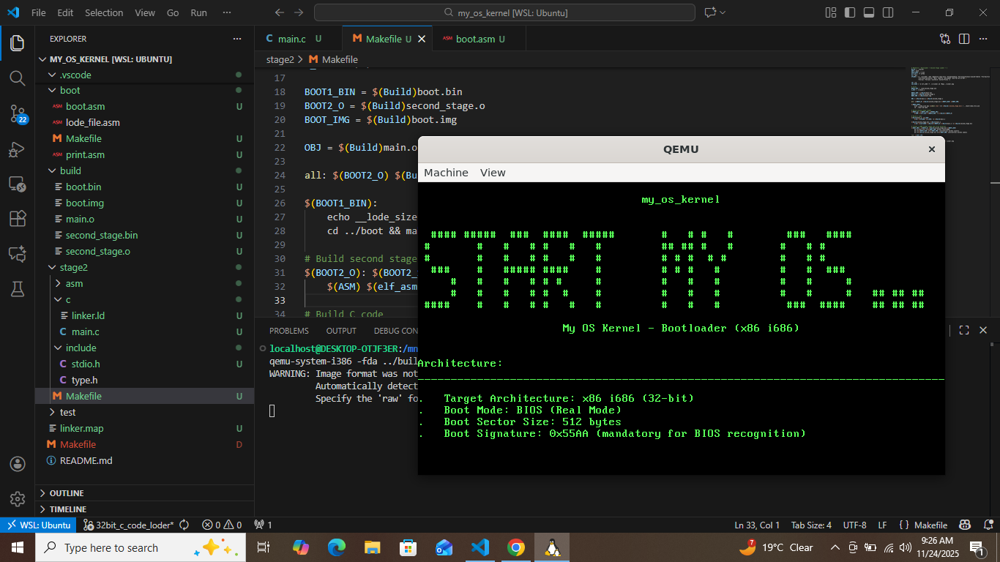

# **My 32-bit OS – v0.1**

**First Protected Mode Boot + C VGA Print System Working**

Ye project ek **custom 32-bit OS** hai jo **Real Mode se Protected Mode** me switch karta hai, aur **C printf + VGA text mode** ke saath completely working output system provide karta hai.
Is version me **project structure optimize**, **printf formatting support**, **color + cursor control**, aur **clean build system** fix kiya gaya hai.

---

## My OS Screenshot



## **Features (v0.1)**

* **Custom Bootloader (boot.asm)**
* **Real Mode → Protected Mode switch**
* **Second stage loader in C**
* **VGA Text Mode fully working**
* `printf()` support:

  * `%c` (character)
  * `%s` (string)
  * `%d / %i` (signed int)
  * `%u` (unsigned dec)
  * `%x` (hex)
  * `%b` (binary)
  * `%w` (word 16-bit hex)
* **Screen Color control (foreground + background macros)**
* **Cursor Position set (setXy)**
* **Screen clear (cls) function**
* **Project structure clean + modular**
* **Makefile one-command build system**

---

## **Project Structure**

```
├── Makefile
├── README.md
├── boot
│   ├── Makefile
│   ├── boot.asm
│   ├── lode_file.asm
│   └── print.asm
├── build
│   ├── boot.bin
│   ├── boot.img
│   ├── main.o
│   ├── second_stage.bin
│   └── second_stage.o
├── linker.map
├── my_os.png
└── stage2
    ├── Makefile
    ├── asm
    │   └── second_stage.asm
    ├── c
    │   ├── linker.ld
    │   └── main.c
    └── include
        ├── stdio.h
        └── type.h
```

---

## **Build & Run Commands**

### **Build**

```sh
make clean
make
```

### **Run in QEMU**

```sh
make run
```
